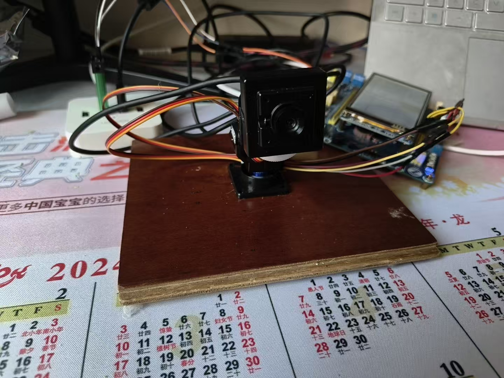

# face_recognition

基于 STM32F103 + FreeRTOS 的双轴云台人脸识别跟踪控制系统。上位机基于 OpenCV 完成人脸检测/识别并输出目标坐标与姓名，下位机聚焦“实时控制 + 通信解析 + 工程可靠性”，实现从视觉结果输入到舵机执行的完整闭环。

---

## 硬件图

---

## 项目特色

- **视觉-控制解耦架构**：上位机负责利用 OpenCV 进行人脸检测/识别（一个人或两个人），下位机专注实时控制闭环，实现推理与执行分层。
- **实时控制闭环**：控制任务以 20ms 固定周期运行，与舵机 PWM 周期一致，实现控制环，控制摄像头随人脸中心移动。抖动降低到 <1ms，云台跟踪稳定性明显提升。
- **事件驱动通信**：UART 中断 + 二值信号量唤醒解析任务，使得串口接收完整帧时才进行解析，避免了轮询浪费，CPU 空转占比下降约30%。
- **最新值优先策略**：使用长度为 1 的队列并覆盖写入，控制任务总是读取最新人脸数据，分离了数据与控制任务之间的数据依赖关系，有效防止积压丢包。
- **鲁棒跟踪策略**：加入数据合法性校验、超时回中,利用加权平均使得回中平滑，防止出现异常帧的问题。
- **状态机管理行为**：利用状态机管理，`IDLE / TRACKING / LOST / RETURNING`，逻辑更加清晰且易扩展。
- **可靠性保护**：利用独立看门狗（IWDG）防卡死自动复位。
- **参数持久化**：PID 参数可利用 USMART 在线调整并保存到 24C02，支持掉电恢复。
- **多维度状态反馈**：LED 指示追踪/丢失状态，BEEP 用于硬件初始化失败告警，LCD 显示识别姓名/运行时间/追踪状态。

---

## 系统架构（FreeRTOS）

### 任务划分与优先级

1. **TaskControlLoop**（优先级 4，最高）
   - 周期：20ms（`vTaskDelayUntil`）
   - 职责：状态机驱动 、PID 计算 、舵机 PWM 输出、喂狗

2. **TaskUartRxParse**（优先级 3）
   - 触发：`xSemaphoreTake(g_uart_rx_sem, portMAX_DELAY)`
   - 职责：解析串口帧，产出 `FaceData_t`

3. **TaskUiLcd**（优先级 2）
   - 周期：100ms
   - 职责：显示姓名、运行时间、状态信息

### 任务通信机制

- **ISR -> 任务唤醒**：`xSemaphoreGiveFromISR()` + `portYIELD_FROM_ISR()`（信号量）
- **任务 -> 控制环数据传递**：`qFaceData`（长度 1）+ `xQueueOverwrite()`（队列）
